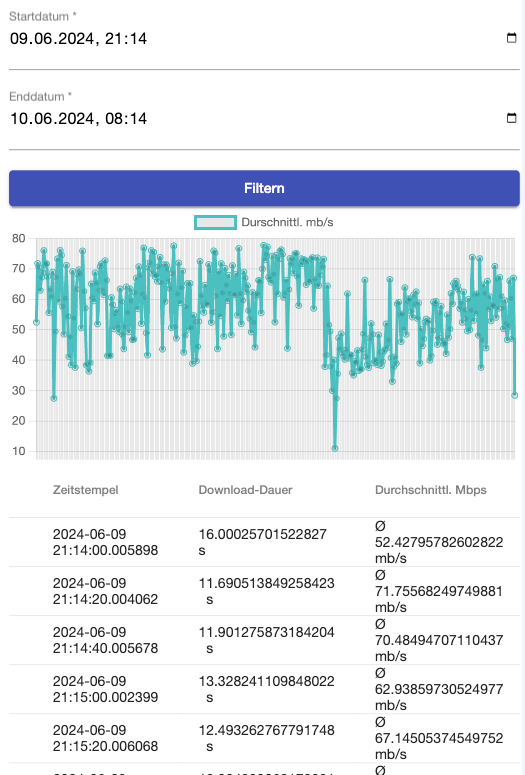

# Download Speed Measurer



## Erstellung des Docker Images

Erst bauen des Images
```console
docker build . -t iking1211/download_speed_measurer:latest
```

Dann den Container starten
```console
docker run -d -p 80:8000 iking1211/download_speed_measurer:latest
```